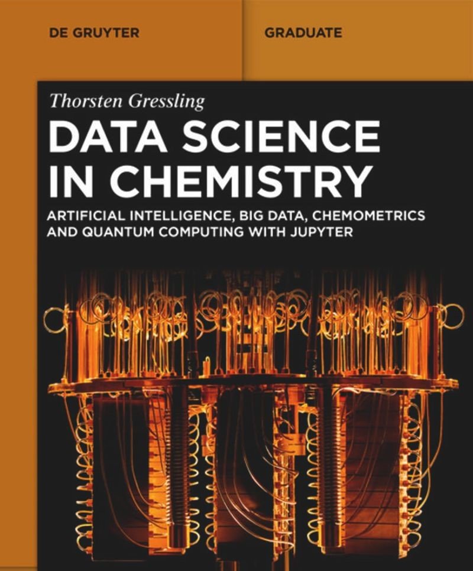
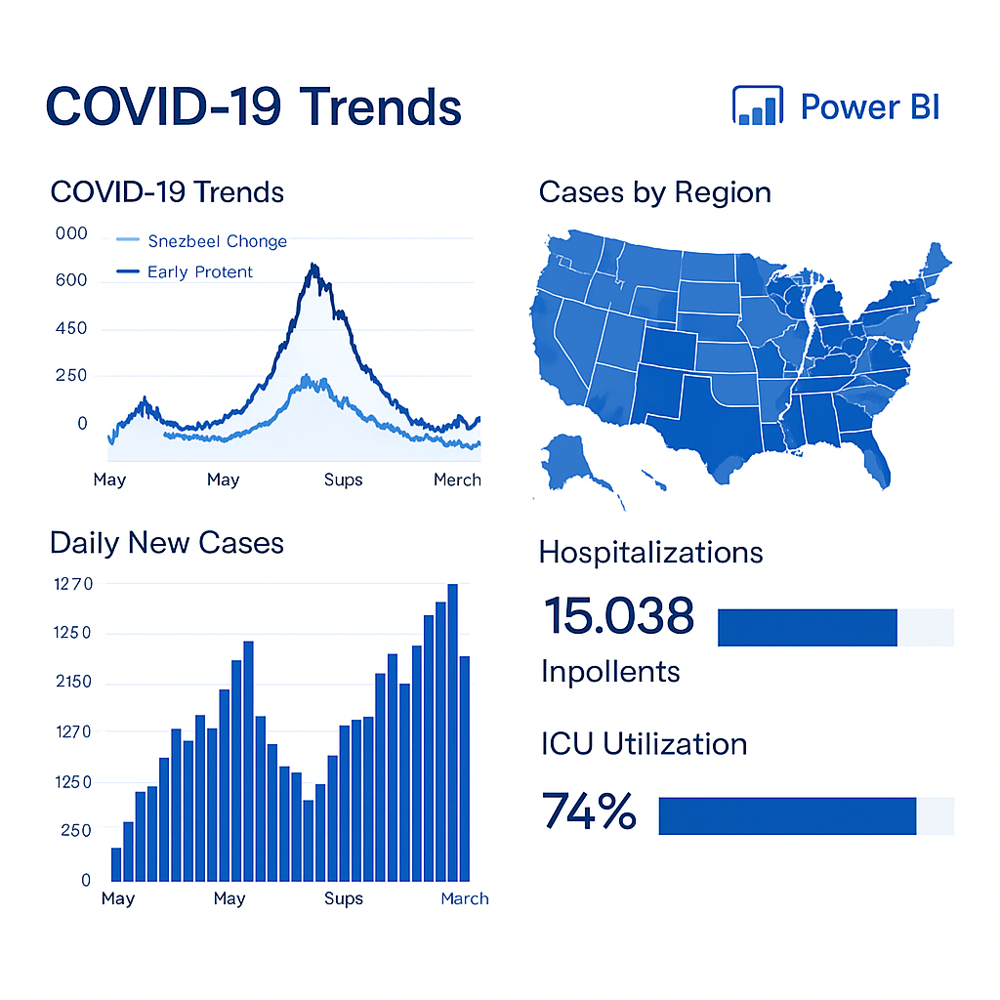
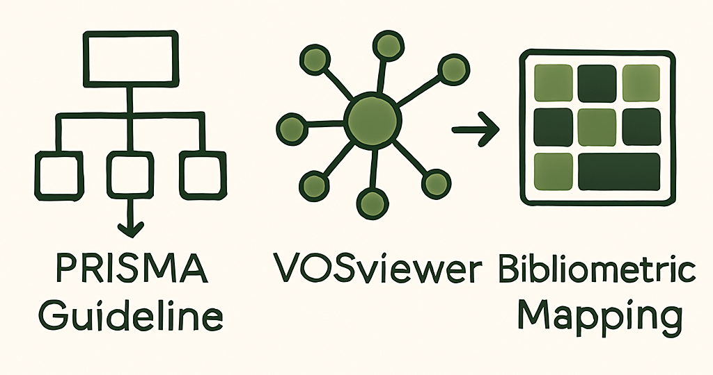

# Theophilus Ofori Agyekum
*Science Data Analyst | Chemical & Organometallic Chemistry Researcher*

Welcome to my data science portfolio. I specialize in applying data analytics to scientific 
research, with a strong foundation in Chemistry and hands-on experience in Python, SQL, and Power BI. 
My work bridgesthe gap between experimental science and data-driven insights—supporting innovation in 
sustainability, energy, and healthcare.

---

## 📌 About Me

Hello, I am **Theophilus Agyekum**, a Chemistry graduate with a strong interest in scientific research and data analysis. 
My academic background, combined with technical training from the **Generation Ghana Data Analyst program**, equips me with 
the skills to support data-driven innovation. I am particularly passionate about applying data analytics in **organometallic research** 
to drive advancements in energy, medicine, and sustainable chemistry.

By integrating programming skills in Python and SQL with visualization tools like Power BI, I focus on uncovering insights from
scientific datasets, improving experimental efficiency, and enabling evidence-based discovery. I value scientific accuracy, critical 
thinking, and the translation of complex data into practical outcomes that support **real-world solutions**.

---

## 🧰 Technical Toolbox

- **Languages:** Python, SQL  
- **Libraries:** Pandas, NumPy, SciPy, Matplotlib, Seaborn, Math  
- **Visualization:** Power BI, Excel, Tableau  
- **Scientific Tools:** ChemDraw, VOSviewer, PRISMA  
- **Web & UI:** HTML, CSS, Tailwind CSS  
- **Other:** Microsoft Office Suite, systematic review design

---

## 🚀 Projects

### 📊 COVID-19 Data Dashboard
A Power BI dashboard analyzing COVID-19 trends, regional case distribution, and healthcare capacity.

### 🤖 Web Automation with Python
Automated form submissions using Selenium to streamline repetitive research data entry tasks.

### 🧬 PRISMA-Compliant Systematic Review Pipeline
Developed a reproducible review framework using PRISMA guidelines and VOSviewer for bibliometric mapping.

### ♻️ Green Fiber from Pineapple Waste
Collaborated on research to convert pineapple leaf waste into eco-friendly fibers using green chemistry principles.

---

## 🧑🏽‍🏫 Experience

### **Data Analyst Learner** — *Generation Ghana* 
(Apr 2025 – Present)
- Applied Python, SQL, and Power BI to business case studies.
- Built and deployed dashboards for analysis and presentation.
- Collaborated in cross-functional teams for remote data projects.
- Developed pipelines for cleaning, analysis, and visualization.

### **Research Assistant** — *Kumasi Technical University* 
(Oct 2023 – Dec 2024)
- Conducted research on sustainable fiber production from pineapple leaves.
- Maintained lab equipment and supported experiment planning.
- Assisted students in chemical data interpretation and research execution.
- Contributed to faculty-led research through statistical and qualitative analysis.

### **Teaching Assistant** — *Kumasi Technical University* 
(Nov 2023 – Dec 2024)
- Supervised thesis projects and facilitated academic writing support.
- Supported lab sessions and chemical software training.
- Managed records and class engagement.

### **Academic Intern** — *Christ Apostolic School Complex* 
(Sep 2022 – Dec 2022)
- Instructed science classes with tailored lesson plans.
- Encouraged student inquiry through active discussions and practical projects.

---

## 📝 Publications

- **Agyekum, T. O.** (2024). *Sustainable Fiber Extraction from Pineapple Leaf Waste: A Green Chemistry Approach*.
Department of Chemical Engineering, Kumasi Technical University.

---

## 🥇 Leadership

- **Sports & Entertainment Head**, KNUST Chemistry Dept. (2021–2023)  
  Led student events and inter-departmental collaborations. Chaired planning for the 23rd National Chemical Society Conference in 2023.

---

## 🎓 Education & Certifications

- **BSc Chemistry** — Kwame Nkrumah University of Science and Technology (2023)  
- **Generation Data Analysis Program** — Generation Ghana (2025)  
- **Learn to Program: The Fundamentals** — University of Toronto via Coursera (2024)

---

## 📬 Contact

- 📧 [Email](mailto:theophylls80@gmail.com)  
- 💼 [LinkedIn](http://www.linkedin.com/in/theophilus-ofori-agyekum-1a16a0193) 
- 💻 [GitHub](https://github.com/freemil80)

---

*I use data to bridge science and innovation—transforming research into real-world impact.*

---
---

## 📧 Newsletter Signup

Stay updated with my latest work and insights! Subscribe for updates on research, data analysis projects, and career developments.

➡️ [*Click here to join the Freemil Newsletter*](https://freemil80.github.io/newsletter-website/)

> *Your privacy is important to me. I will never share your email address with third parties.*

